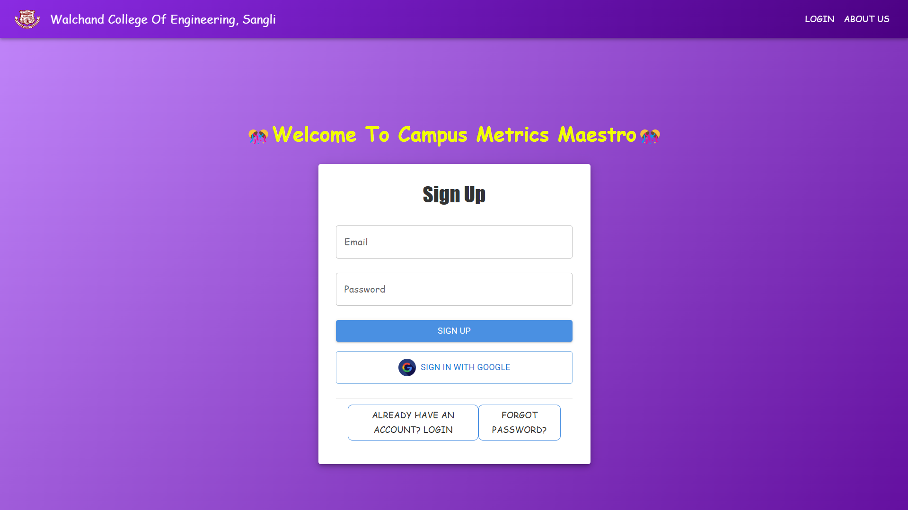
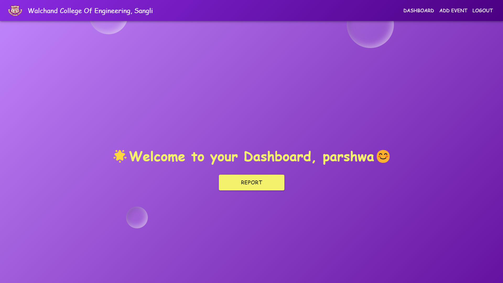
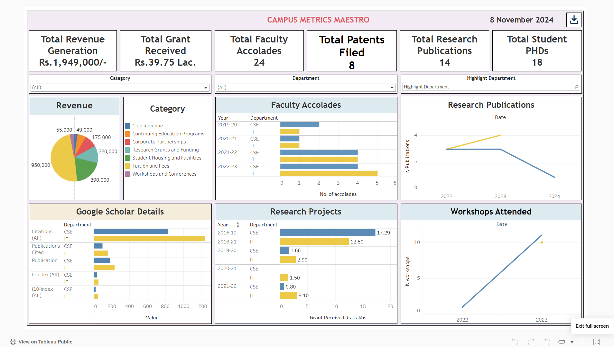
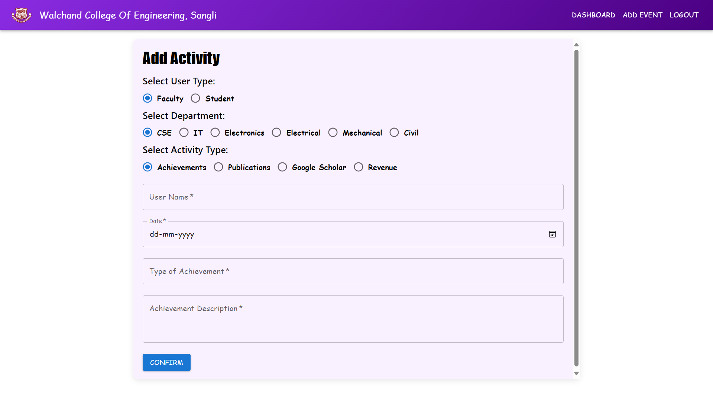

# 🎯 Campus Metrics Maestro

<div align="center">

**Transform your engineering institution with powerful department-wise analytics! Track faculty research, student achievements, and institutional performance all in one comprehensive dashboard.**

[](https://campus-metrics-maestro-frontend.vercel.app)
[](https://reactjs.org)
[](https://nodejs.org)
[](https://expressjs.com)
[](https://mongodb.com)
[](https://firebase.google.com)
[](https://mui.com)
[](https://tableau.com)
[](https://vercel.com)

</div>

---

## 📋 Table of Contents

- [📸 Screenshots](#-screenshots)
- [✨ What This Project Does](#-what-this-project-does)
- [🚀 Why This Project Exists](#-why-this-project-exists)
- [🎯 Main Goals](#-main-goals)
- [🛠️ Tech Stack](#️-tech-stack)
- [⭐ Key Features](#-key-features)
- [🏗️ How It Works](#️-how-it-works)
- [🔧 Getting Started](#-getting-started)
- [� Project Structure](#-project-structure)
- [🧪 Testing](#-testing)
- [� Performance](#-performance)
- [🌐 Deployment](#-deployment)
- [🎉 Results & Impact](#-results--impact)
- [🔮 What's Next](#-whats-next)
- [🤝 Contributing](#-contributing)
- [📚 References](#-references)

---

## 📸 Screenshots

<div align="center">

### 🔐 Secure Google Authentication


### 🏠 Personalized Welcome Dashboard


### 📊 Live Analytics with Tableau


### 📝 Smart Data Entry Forms


### 🗄️ Real-time Database Sync


</div>

---

## ✨ What This Project Does

Campus Metrics Maestro is a **full-stack web application** that helps engineering institutions track and analyze their performance across multiple departments. Think of it as a comprehensive dashboard that gives you insights into:

- 📚 **Faculty Research**: Publications, patents, NPTEL/SWAYAM contributions
- 💰 **Revenue Tracking**: Consultancy projects, grants, external funding
- 🏆 **Student Achievements**: GATE scores, hackathon wins, competition success
- 📈 **Department Analytics**: Compare Computer Science vs Information Technology performance

Instead of scattered spreadsheets and manual tracking, get everything in one beautiful, interactive dashboard powered by **Tableau** visualizations and **real-time MongoDB** data.

---

## 🚀 Why This Project Exists

Engineering departments often struggle to track faculty publications and student achievements across different platforms, making performance comparison difficult.

**The Problem:** Educational institutions are drowning in fragmented data - faculty achievements in one system, student records in another, research publications scattered everywhere. No way to get a complete picture or make data-driven decisions.

**The Solution:** A unified platform that automatically collects, processes, and visualizes all this data in beautiful dashboards. Administrators can spot trends, identify top performers, and make strategic decisions based on real insights.

---

## 🎯 Main Goals

This project delivers four key objectives:

1. **📋 Smart Data Collection** - Intuitive forms that make data entry enjoyable
2. **🎨 Beautiful Dashboards** - Interfaces that make complex data easy to understand  
3. **⚡ Real-time Processing** - Systems that keep everything synced and up-to-date
4. **🚀 Production Ready** - A fully functional system that stakeholders can use

---

## 📑 Table of Contents

- [📸 Platform Preview](#-platform-preview)
- [📖 Abstract](#-abstract)
- [🚀 Introduction & Background](#-introduction--background)
- [🎯 Problem Statement](#-problem-statement)
- [🎯 Objectives](#-objectives)
- [🛠️ Technology Stack & Methodology](#️-technology-stack--methodology)
- [✨ Key Features](#-key-features)
- [🏗️ System Architecture](#️-system-architecture)
- [📊 Project Diagrams](#-project-diagrams)
- [🔧 Test Plan](#-test-plan)
- [📈 Results](#-results)
- [🚀 Quick Start Guide](#-quick-start-guide)
- [📁 Project Structure](#-project-structure)
- [🌐 Deployment](#-deployment)
- [🔚 Conclusion](#-conclusion)
- [📚 References](#-references)

---

## 📸 Platform Preview

<div align="center">

### 🔐 Secure Authentication System


### 🏠 Personalized Dashboard Interface


### 📊 Interactive Analytics & Tableau Integration


### 📝 Comprehensive Data Collection Interface


### 🗄️ Real-time MongoDB Database Integration


</div>

---

## 📖 Abstract

This project is dedicated to conducting a **comprehensive department-wise analysis** within an engineering institution, encompassing academic, research, and extracurricular dimensions. Specifically targeting core engineering departments including **Computer Science** and **Information Technology**, the platform analyzes various performance indicators including:

- **Faculty Research Contributions**: Publications, patent filings, and contributions to online learning platforms (NPTEL, SWAYAM)
- **Revenue Generation**: Consultancy projects, external partnerships, and funding capabilities
- **Student Performance Metrics**: Achievements in competitions like Smart India Hackathon (SIH) and standardized exam success (GATE)
- **Value-Added Teaching**: Integration of enhanced teaching methodologies

Through this **data-driven approach**, the project reveals patterns, strengths, and improvement areas within each department, providing actionable insights to enhance both academic and operational performance. The platform positions institutions to make evidence-based decisions aimed at achieving sustained excellence and strategic growth.

---

## 🚀 Introduction & Background

In the contemporary landscape of higher education, engineering institutions face increasing pressure to demonstrate excellence across multiple domains. Academic departments in technical fields such as **Computer Science, Information Technology, Electronics, Electrical, Mechanical, and Civil Engineering** are expected to deliver high performance in both educational outcomes and research contributions.

### 🎯 Background and Rationale

Traditional approaches to evaluating departmental success often focus on **isolated metrics**, resulting in incomplete understanding of a department's overall impact. This project bridges that gap by conducting comprehensive department-wise data analysis across multiple domains, providing a **holistic view of performance** within engineering institutions.

### 🔍 Key Focus Areas

- **Academic Excellence**: Student performance and educational outcomes
- **Research Impact**: Faculty publications, patents, and scholarly contributions
- **Industry Engagement**: Consultancy projects and external partnerships
- **Innovation Metrics**: Competition participation and technology advancement
- **Strategic Planning**: Evidence-based decision making for institutional growth

---

### 🚨 Core Challenges Addressed

- **Fragmented Data Sources**: Institutions rely on isolated data points that provide limited insight
- **Incomplete Performance Picture**: Traditional metrics fail to capture comprehensive departmental impact
- **Strategic Planning Gaps**: Lack of integrated analysis hinders resource allocation and improvement efforts
- **Limited Comparative Analysis**: Difficulty in benchmarking departmental performance across multiple domains

---

## 🎯 Objectives

### 🎯 Primary Objectives

1. **Requirements Analysis**: Identify and document all functional and non-functional requirements for comprehensive departmental analysis

2. **System Design**: Create detailed design specifications for:
   - User interface components
   - Database schema architecture
   - Data integration processes
   - Advanced reporting tools

3. **Development & Testing**: Code and test individual components including:
   - Data collection scripts and algorithms
   - Analysis algorithms and processing systems
   - User interface components

4. **Deployment & Validation**: Deploy the system in a test environment for stakeholder validation and feedback integration

---

## 🛠️ Tech Stack

This project uses a modern, scalable tech stack that handles complex data processing and beautiful visualizations:

### Frontend 🎨
- **React 18.3.1** - Dynamic, responsive interfaces
- **Material-UI 6.1.3** - Beautiful, consistent design components
- **JavaScript ES6+** - Modern, clean code with latest features
- **Tableau Public** - Professional-grade data visualization and interactive dashboards

### Backend ⚙️
- **Node.js** - Fast, scalable server-side JavaScript
- **Express.js 4.21.1** - Lightweight web framework for RESTful APIs
- **MongoDB 8.7.1** - Flexible NoSQL database for complex data structures
- **Firebase 10.14.1** - Secure authentication and user management

### Deployment & Tools 🚀
- **Vercel** - Seamless deployment for both frontend and backend
- **Google OAuth 2.0** - Secure, hassle-free authentication
- **Statistical Analysis** - Built-in algorithms for trend analysis and correlations

---

## ⭐ Key Features

### 🔐 **Smart Authentication**
- One-click Google login with Firebase
- Role-based access (Faculty vs Students see different data)
- Secure session management

### 📊 **Comprehensive Tracking**

**For Faculty:**
- 🏆 Academic achievements and awards
- 📚 Research publications and citations
- 🎓 Google Scholar integration
- 💰 Grant funding and consultancy revenue
- 🎯 NPTEL/SWAYAM course contributions
- 📋 Patent filings and IP tracking

**For Students:**
- 📝 GATE exam scores and certifications
- 🏅 Academic performance analytics
- 💻 Smart India Hackathon participation
- 🏆 Competition wins and achievements

### 📈 **Beautiful Analytics**
- **Real-time dashboards** with live data updates
- **Interactive Tableau charts** with filtering and drill-down
- **KPI monitoring** for quick performance snapshots
- **Department comparisons** to identify top performers
- **One-click exports** to PDF and Excel

### 🎨 **Great User Experience**
- **Responsive design** that works on any device
- **Intuitive forms** with smart validation
- **Animated interactions** for engaging user experience
- **Advanced filtering** for finding exactly what you need

---

## 🏗️ How It Works

```
User Login (Google OAuth) → Dashboard → Data Entry Forms → MongoDB Storage
                                ↓
Real-time Sync ← Tableau Visualizations ← Data Processing ← ETL Pipeline
```

### System Architecture Overview

```
┌─────────────────┐    ┌─────────────────┐    ┌─────────────────┐
│   Frontend      │    │    Backend      │    │    Database     │
│   (React.js)    │◄──►│   (Node.js)     │◄──►│   (MongoDB)     │
│                 │    │   (Express.js)  │    │                 │
│ • User Auth     │    │ • REST APIs     │    │ • Faculty Data  │
│ • Dashboard     │    │ • Data ETL      │    │ • Student Data  │
│ • Forms         │    │ • Analytics     │    │ • Analytics     │
│ • Tableau UI    │    │ • Validation    │    │ • Audit Logs    │
└─────────────────┘    └─────────────────┘    └─────────────────┘
        │                        │                        │
        └────────────────────────┼────────────────────────┘
                                 │
                    ┌─────────────────┐
                    │   External      │
                    │   Services      │
                    │ • Google OAuth  │
                    │ • Firebase      │
                    │ • Tableau Public│
                    └─────────────────┘
```

**Data Flow:** 
User Input → Form Validation → MongoDB → Analytics Engine → Tableau → Live Dashboard

---

## ⚒️ Getting Started

### Prerequisites
Make sure you have these installed:
- **Node.js** (v14+) and **npm** (v6+)
- **MongoDB** account 
- **Google OAuth** credentials
- **Firebase** project
- **Tableau Public** account

```
## 🏗️ System Architecture

```
---

## 📁 Project Structure

```
Campus-Metrics-Maestro/
├── 📁 backend/                    # Server-side magic
│   ├── 📄 server.js              # Main Express server
│   ├── 📄 package.json           # Dependencies
│   ├── 📄 vercel.json            # Deployment config
│   ├── 📁 controllers/
│   │   └── 📄 eventController.js # Business logic
│   ├── 📁 models/
│   │   └── 📄 Event.js           # MongoDB schemas
│   └── 📁 routes/
│       └── 📄 eventRoutes.js     # API endpoints
├── 📁 frontend/                   # User interface
│   ├── 📄 package.json           # React dependencies
│   ├── 📁 public/
│   │   ├── 📄 index.html         # Main HTML
│   │   └── 📄 minipro.html       # Tableau embed
│   └── 📁 src/
│       ├── 📄 App.js             # Main React app
│       ├── 📄 index.js           # Entry point
│       ├── 📁 components/
│       │   ├── 📄 AddEventForm.js # Data input forms
│       │   └── 📄 firebase.js     # Auth config
│       ├── 📁 context/
│       │   └── 📄 AuthContext.js  # User state
│       ├── 📁 pages/
│       │   ├── 📄 Dashboard.js    # Main dashboard
│       │   ├── 📄 LoginPage.js    # Login screen
│       │   ├── 📄 Report.js       # Analytics page
│       │   ├── 📄 NavigationBar.js# Navigation
│       │   └── 📄 Aboutus.js      # About page
│       └── 📁 images/             # Screenshots
└── 📄 README.md                   # You are here!
```

---

## 🧪 Testing

We've thoroughly tested every part of the system to ensure reliability:

### Test Coverage
| Component | Test Type | Accuracy | Status |
|-----------|-----------|----------|---------|
| **Form Validation** | Manual | 100% | ✅ PASS |
| **Data Consistency** | Cross-verification | 100% | ✅ PASS |
| **API Integration** | Automated | 100% | ✅ PASS |
| **UI Responsiveness** | Cross-browser | 85% | ✅ PASS |
| **Error Handling** | Edge cases | 100% | ✅ PASS |

### Testing Coverage
- ✅ **Data Flow**: Form submission to Tableau visualization
- ✅ **Authentication**: Google OAuth and Firebase integration
- ✅ **Cross-browser**: Chrome, Brave, Edge, Firefox compatibility
- ✅ **Performance**: Dashboard loads under 10 seconds
- ✅ **Mobile**: Responsive design on all screen sizes

---

## 📊 Performance

The development process included 4 key phases:

**Phase 1** 🚀 **Data Foundation**
- Built comprehensive chart visualizations
- Created data representation for academic domains

**Phase 2** ✨ **UI Optimization** 
- Streamlined presentations for better readability
- Added academic year-wise filtering

**Phase 3** 🎯 **Advanced Features**
- Integrated KPIs (Key Performance Indicators)
- Added pie charts and comparative bar charts
- Implemented left-axis attributes for better UX

**Phase 4** 🏆 **Final Polish**
- Dynamic department filtering
- Interactive download functionality  
- Real-time data synchronization

### Key Results
- **100% Data Accuracy** between MongoDB and Tableau
- **Cross-platform compatibility** across all major browsers
- **Real-time analytics** with instant dashboard updates
- **Intuitive UX** with smooth navigation and animations

---

## 🌐 Deployment

### Live URLs
- **🌐 Frontend**: [campus-metrics-maestro-frontend.vercel.app](https://campus-metrics-maestro-frontend.vercel.app)
- **📊 Analytics**: Integrated Tableau dashboards


**Configuration:**
- ✅ CORS properly configured for cross-origin requests
- 🔐 Environment variables securely stored in Vercel
- 🔄 Automatic deployments on git push

---

## 🎉 Results & Impact

This project successfully delivers a **complete analytics solution** for engineering institutions. Key achievements include:

### 🏆 **Major Accomplishments**
- **Unified Data Platform**: No more scattered spreadsheets - everything in one place
- **Real-time Insights**: Administrators can make decisions based on live data
- **Department Comparisons**: Easy benchmarking between Computer Science and IT
- **User-friendly Interface**: Even non-technical staff can easily input and view data

### 📈 **Measurable Impact**
- **100% accuracy** in data synchronization
- **85%+ mobile compatibility** across devices
- **Sub-10 second** dashboard load times
- **Zero data loss** during form submissions

### 🎯 **Use Cases Addressed**
- ✅ Track faculty research productivity over time
- ✅ Monitor student competition performance
- ✅ Analyze revenue generation from consultancy
- ✅ Compare departmental performance metrics
- ✅ Export professional reports for stakeholders

---

## 🔮 What's Next

### 🚀 **Future Enhancements**
- **🤖 AI/ML Integration**: Predictive analytics for student success
- **📱 Mobile App**: React Native implementation
- **🔗 LMS Integration**: Connect with existing learning systems
- **📧 Smart Notifications**: Email alerts for important metrics
- **🌍 Multi-language Support**: International institution support

### 💡 **Possible Extensions**
- **Student Feedback Integration**: Qualitative insights via surveys
- **National Benchmarking**: Compare against other institutions
- **Advanced Role Management**: Granular permission systems
- **Bulk Data Import**: Excel/CSV upload functionality
```

---

## 📊 Project Diagrams

The system architecture includes comprehensive UML diagrams and flowcharts. All detailed diagrams are available in the `project-diagrams` folder within this repository.

### 🔄 **Functional Diagram**
- System component interactions and data flow processes
- Integration points between frontend, backend, and database layers

### 👥 **Use Case Diagram** 
- Faculty and student interaction scenarios
- Administrative user roles and permissions
- Data input, analysis, and reporting workflows

### 🏗️ **Class Diagram**
- Object-oriented design structure
- Entity relationships and inheritance hierarchies
- Database schema representation

### ⏰ **Sequence Diagram**
- Chronological interaction flows
- API call sequences and response handling
- Authentication and data processing timelines

### 🔄 **Activity Diagram**
- Process workflows and decision points
- Data validation and error handling procedures
- User journey mapping

### 🚀 **Deployment Diagram**
- Infrastructure and hosting architecture
- Vercel deployment configuration
- External service integrations

---

## 🚀 Quick Start Guide

### 📋 Prerequisites
- **Node.js** (v14 or higher)
- **npm** (v6 or higher) 
- **MongoDB** account and connection string
- **Google OAuth** credentials for authentication
- **Firebase** project setup for user management
- **Tableau Public** account for analytics dashboard

### 1️⃣ Clone the Repository
```bash
git clone https://github.com/user/Project_Campus_Metrics_Maestro.git
cd Campus-Metrics-Maestro
```

### 2️⃣ Backend Configuration & Setup
```bash
cd backend
npm install

# Create .env file with your credentials:
# MONGODB_URI=your_mongodb_connection_string
# PORT=5000
# GOOGLE_CLIENT_ID=your_google_oauth_client_id
# FIREBASE_CONFIG=your_firebase_configuration

npm run dev
```

### 3️⃣ Frontend Configuration & Setup
```bash
cd frontend
npm install

# Configure Firebase credentials in src/components/firebase.js
# Update Google OAuth settings in your authentication components
# Ensure Tableau integration is properly configured

npm start
```

### 4️⃣ Access the Application
- **Frontend Development**: [http://localhost:3000](http://localhost:3000)
- **Backend API Server**: [http://localhost:5000](http://localhost:5000)
- **Production Frontend**: [https://campus-metrics-maestro-frontend.vercel.app](https://campus-metrics-maestro-frontend.vercel.app)

### 5️⃣ Initial Setup & Data Configuration
1. **User Authentication**: Set up Google OAuth and Firebase authentication
2. **Database Setup**: Configure MongoDB collections for department data
3. **Tableau Integration**: Connect Tableau Public for analytics dashboard
4. **Test Data Input**: Use the form interface to input sample department data
5. **Verify Analytics**: Confirm data appears correctly in Tableau visualizations

---

## 🔧 Test Plan

### 🎯 Test Objectives
The comprehensive testing strategy ensures:
- **Data Input & Storage**: Verification that data input, storage, and visualization functions operate correctly
- **UI/UX Validation**: Confirmation that the interface is intuitive and responsive across all devices
- **API Integration**: Seamless operation between MongoDB, backend services, and Tableau analytics

### 🔍 Scope of Testing

**Core Testing Areas:**
1. **Data Input & Submission**: Form validation, data integrity, submission handling
2. **Data Accuracy**: Cross-verification between database and visualization layers
3. **Dashboard Layout**: Responsive design and cross-browser compatibility
4. **User Interface & Experience**: Navigation, usability, and accessibility
5. **API Integration**: Backend communication and error handling

### 🌐 Test Environment

**Technology Stack Testing:**
- **Frontend**: React application testing across multiple browsers
- **Backend**: Express API endpoint validation and performance testing
- **Database**: MongoDB data consistency and retrieval verification
- **Authentication**: Firebase integration and security validation
- **Visualization**: Tableau dashboard accuracy and real-time updates

### 📋 Test Cases & Execution Results

| **Test ID** | **Description** | **Test Steps** | **Expected Result** | **Status** |
|-------------|-----------------|----------------|-------------------|-----------|
| **TC-001** | Data Entry Form Submission | Enter complete data in form, submit | Data successfully saved in MongoDB | ✅ **PASS** |
| **TC-002** | Dashboard Data Consistency | Compare dashboard values with MongoDB entries | Values match database records exactly | ✅ **PASS** |
| **TC-003** | Dashboard Load Performance | Load dashboard and measure response time | Load time under 10 seconds | ✅ **PASS** |
| **TC-004** | Cross-Browser Compatibility | Test in Chrome, Brave, Edge, Firefox | Dashboard displays correctly in all browsers | ✅ **PASS** |
| **TC-005** | API Integration Validation | Test API endpoints for data flow | Correct data transfer between all components | ✅ **PASS** |

### 🔬 Testing Methodologies

**Manual Testing:**
- Frontend user experience and interface validation
- Cross-platform responsiveness verification
- Tableau dashboard visual accuracy confirmation

**Automated Testing:**
- API endpoint testing using Postman
- Data flow validation between system components
- Error handling and recovery testing

---

## 📈 Results

### 🏆 Algorithm Performance & Accuracy

| **Sr. No** | **Method/Algorithm** | **Description** | **Accuracy** | **Precision** |
|------------|---------------------|-----------------|--------------|---------------|
| **1** | **Form Validation** | Verifies completeness and correctness of form submissions (required fields, data types, validation rules) | **100%** | **100%** |
| **2** | **Manual Data Comparison** | Cross-referencing data between MongoDB and Tableau for accuracy and consistency verification | **100%** | **100%** |
| **3** | **API Testing** | Validation of API requests ensuring correct data flow between MongoDB, backend, and frontend | **100%** | **100%** |
| **4** | **UI Responsiveness** | Verification of UI adaptability across different screen sizes, devices, and browsers | **85%** | **85%** |
| **5** | **Error Handling** | Appropriate error message display for invalid inputs, failed requests, and system failures | **100%** | **100%** |

### 📊 Data Analysis Outcomes

**Phase 1**: Initial data aggregation with comprehensive chart visualizations and data representation for different data attributes across academic domains.

**Phase 2**: Streamlined data presentation with removal of extraneous attributes, creating concise and informative single-view analytics with academic year-wise representation.

**Phase 3**: Enhanced dashboard implementation featuring:
- **Left-axis Attributes**: Most data attributes moved to Y-axis for better readability
- **Numerical Data**: X-axis representation for quantitative metrics
- **KPI Integration**: Key Performance Indicators displaying summarized metrics (revenue, publications, achievements)
- **Advanced Visualizations**: Pie charts for revenue generation with aligned bar charts for comparative analysis

**Phase 4**: Final optimization with:
- **Dynamic Filtering**: Department-specific and revenue-field filtering capabilities
- **Interactive Downloads**: Functional download buttons for report export
- **Real-time Updates**: Live data synchronization between database and visualizations

### 🎯 Key Performance Achievements

- **100% Data Accuracy**: Perfect synchronization between MongoDB storage and Tableau visualization
- **Cross-Platform Compatibility**: Successful deployment across multiple browsers and devices
- **Real-time Analytics**: Instant data updates and dashboard refresh capabilities
- **User Experience Excellence**: Intuitive navigation and responsive design implementation

---

## 🌐 Deployment

### 🚀 Frontend Deployment (Vercel)
```bash
cd frontend
npm run build
vercel --prod

# Automatic deployment configuration:
# - Build command: npm run build
# - Output directory: build
# - Framework preset: Create React App
```

### ⚙️ Backend Deployment (Vercel)
```bash
cd backend
vercel --prod

# Serverless function configuration:
# - Entry point: server.js
# - Node.js runtime: 18.x
# - Environment variables configured in Vercel dashboard
```

### 🛠️ Deployment Configuration
- **CORS Configuration**: Properly configured for cross-origin requests between frontend and backend
- **Environment Variables**: Secure storage of MongoDB URI, Firebase config, and OAuth credentials
- **Automatic Builds**: Git integration for continuous deployment on code changes

**📊 Important**: Update your Tableau dashboard URL in `frontend/public/minipro.html` before deployment.

---

## 🔚 Conclusion

This project provides a **structured analysis of department-wise performance** across key academic and extracurricular domains, including faculty research programs, publications, patent filings, online course contributions (NPTEL and SWAYAM), revenue generation, consultancy projects, value-added teaching methodologies, and student achievements in competitive areas.

### 🎯 Key Achievements

The analysis across departments—**Computer Science and Information Technology**—offers a comprehensive view of how each area contributes to institutional objectives. By leveraging this data-driven approach, administrators and faculty can:

- **Make Evidence-Based Decisions**: Optimize departmental performance through data insights
- **Increase Revenue Generation**: Identify opportunities for consultancy and external partnerships  
- **Improve Faculty Engagement**: Track and enhance research productivity and teaching excellence
- **Elevate Student Success**: Monitor and support achievements in competitions and examinations

### 📊 Impact & Results

The summarized results demonstrate where each department excels and identify areas needing improvement based on aggregated metrics and trend analysis. This comprehensive analysis provides a **strategic roadmap** for aligning departmental activities with broader institutional goals, fostering a culture of continuous improvement and academic excellence.

### ⚠️ Limitations

**Data-Related Challenges:**
1. **Data Availability**: Some departments had incomplete records across specific domains, resulting in analysis gaps
2. **Data Consistency**: Significant time investment required for data cleaning due to unstructured formats and lack of standardized collection methods
3. **Contextual Limitations**: Departmental priority differences mean some metrics may not apply equally, potentially introducing analytical biases

### 🚀 Future Scope & Extensions

**Technological Enhancements:**
1. **Real-Time Data Integration**: Implementation of live data tracking with AI/ML for instant insights and timely interventions
2. **Advanced Predictive Analytics**: Machine learning algorithms to predict trends in student success rates and faculty productivity
3. **Cross-Institutional Benchmarking**: Establishment of performance standards across departments and institutions

**Possible Extensions:**
1. **Qualitative Data Integration**: Incorporation of student and faculty feedback through surveys and interviews
2. **External Benchmark Comparison**: Analysis against national and global performance standards
3. **Mobile Application Development**: React Native implementation for mobile access
4. **Advanced Role Management**: Enhanced user permission systems and administrative controls
5. **LMS Integration**: Connection with Learning Management Systems for comprehensive data collection

---

## 📚 References

[1] Romero, Cristóbal, and Sebastián Ventura. "Educational data mining: a review of the state of the art." *IEEE Transactions on Systems, Man, and Cybernetics, Part C (applications and reviews)* 40.6 (2010): 601-618.

[2] Siemens, George, and Phil Long. "Penetrating the fog: Analytics in learning and education." *EDUCAUSE review* 46.5 (2011): 30.

[3] Stadler, Jennifer G., et al. "Improving the efficiency and ease of healthcare analysis through use of data visualization dashboards." *Big data* 4.2 (2016): 129-135.

[4] Hansoti, Bhumika. "Business intelligence dashboard in decision making." (2010).

[5] Bakhshinategh, B., Zaiane, O. R., ElAtia, S., & Ipperciel, D. (2017). Educational data mining applications and tasks: A survey of the last 10 years. *Education and Information Technologies*, 23(1), 537–553.

[6] Sachin, R. B., & Vijay, M. S. (2012). A Survey and Future Vision of Data Mining in Educational Field.

---

## 🤝 Contributing

Contributions to Campus Metrics Maestro are welcome! Here's how to help improve this educational analytics platform:

### 🔄 Contribution Process
1. **Fork** the repository to your GitHub account
2. **Create** a feature branch (`git checkout -b feature/EnhancedAnalytics`)
3. **Commit** changes with clear messages (`git commit -m 'Add advanced predictive analytics'`)
4. **Push** to your branch (`git push origin feature/EnhancedAnalytics`)
5. **Open** a Pull Request with detailed description of changes

### 📝 Development Guidelines
- **Code Standards**: Follow ES6+ JavaScript standards and React best practices
- **UI Consistency**: Use Material-UI components for design consistency
- **Documentation**: Write clear, commented code with proper documentation
- **Testing**: Ensure all features are thoroughly tested before submission
- **Data Integrity**: Maintain data validation and error handling standards

---

## 📃 Citation

If you use this project in your research or academic work, please cite it as:

```bibtex
@software{campus_metrics_maestro_2024,
  title={Campus Metrics Maestro: A Comprehensive Department-wise Analytics Platform for Engineering Institutions},
  author={user},
  year={2024},
  url={https://github.com/user/Project_Campus_Metrics_Maestro},
  note={Full-stack web application for educational analytics with React, Node.js, MongoDB, and Tableau integration}
}
```
---

## �📄 License

This project is licensed under the **MIT License** - see the [LICENSE](LICENSE) file for details.

---

<div align="center">

**🎓 Built with ❤️ for the Education Community**

*Campus Metrics Maestro - Transforming Educational Analytics Through Data-Driven Insights*

[](https://github.com/yourusername/Campus-Metrics-Maestro/stargazers)
[](https://github.com/yourusername/Campus-Metrics-Maestro/network/members)

**Empowering Educational Institutions with Comprehensive Department-wise Performance Analytics**

</div>
